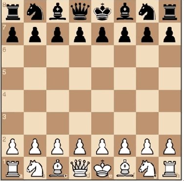

# Kingslayer:  Chess AI that can play gainst humans

Kingslayer is a simple chess game with AI and Deep Neural Network that can play against humans.


## Running the chess engine:

```bash
$ python3 src/game.py
```



## Dependencies

The Dependencies are in the `requirements.txt` namely:

```bash
python-chess

chess~=1.6.1

future~=0.18.2

Pillow~=8.2.0

numpy~=1.20.3

tensorflow~=2.5.0

pandas~=1.2.4

```

## Functionalities Supported:

```bash
•Pawn Capture

•Castling

•En Passant

•Pawn Promotion


•3 hidden layers, neurons are activated using ReLU
•Tanh function used for output layer to keep result between 1 & -1
•Learning rate kept at 0.01


```